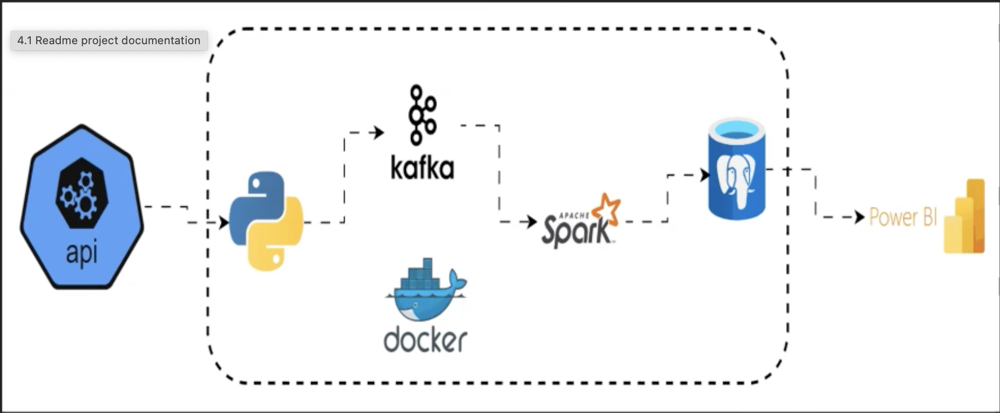

## Project Name : Real Time Stock Market Analysis

The project implements a real time data pipeline that extracts stock data from Alpha Vantage API, streams it through apache Kafka, processes it with apache spark and loads it into postgres database

All components are containerised with docker for easy deployment

### Data pipeline Architecture

### Project Tech Stack and flow
 - `Kafka UI -> inspect topics/messages`
 - `API -> produces JSON events into kafka`
 - `Spark -> Consumes from kafka, writes to postgres`
 - `Postgres -> Stores results for analytics`
 - `pgAdmin -> Manages postgres visually`
 - `Power BI -> external (connects to postgres database)`